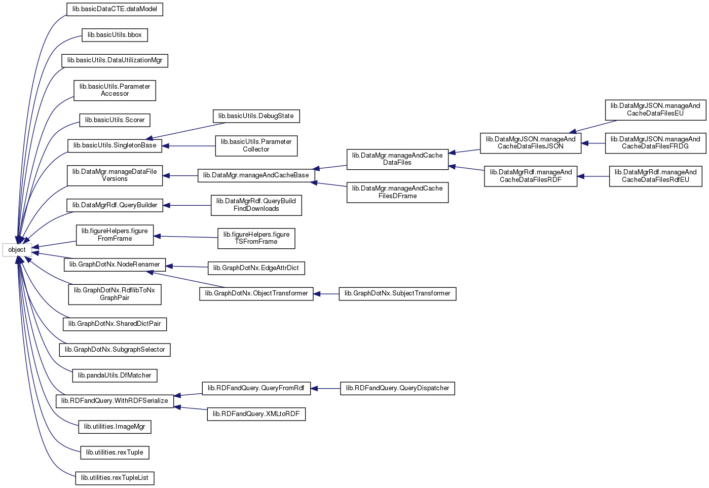

# Library organization

This is implemented in Python3, package requirements in  <A HREF="requirements.txt">requirements.txt<A>.

## Package
The library is organized as follows (for now only one package) in directory `source/lib`:
- utilities
- graphical extensions to matplotlib and/or seaborn
  -  facilitate some composite displays
- access to data files:
  - access and loads data in Panda.DataFrame,
  - file management options:
    - timestamped files in directory,
    - directory used as cache for remote data distribution sites
      -  support for JSON protocol as used on <A HREF="http://www.data.gouv.fr">www.data.gouv.fr</A>
      -  support for JSON protocol used by : deprecated
      -  support for SPARQL+XML protocol used by EU Open Data Portal (EU ODP) <A HREF="https://data.europa.eu/"https://data.europa.eu/</A>
- rdflib utilities
  -  show rdf trees as GraphViz .dot

 ## tests/demos:
      1) test files are available for Python's unittest framework; they show a number of
         use cases
      2) jupyter notebooks show use cases, complete with graphics and comments in directory
       `JupySessions`; they make some hypotheses on the execution environment (working dir, location of files,
       environment variables)
      3) the files exported from jupyter are executable as python scripts
         (some functions from jupyter environment are required). They give the same results as the corresponding
	 notebooks

## Library structure:
     

