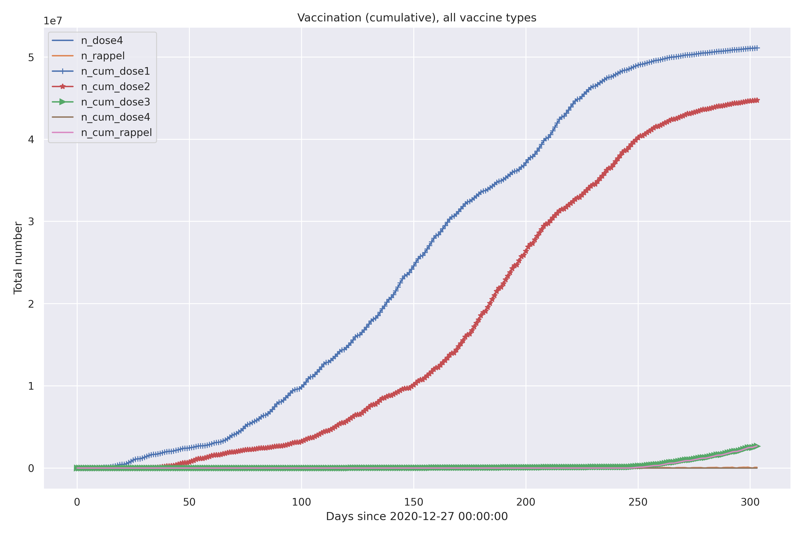
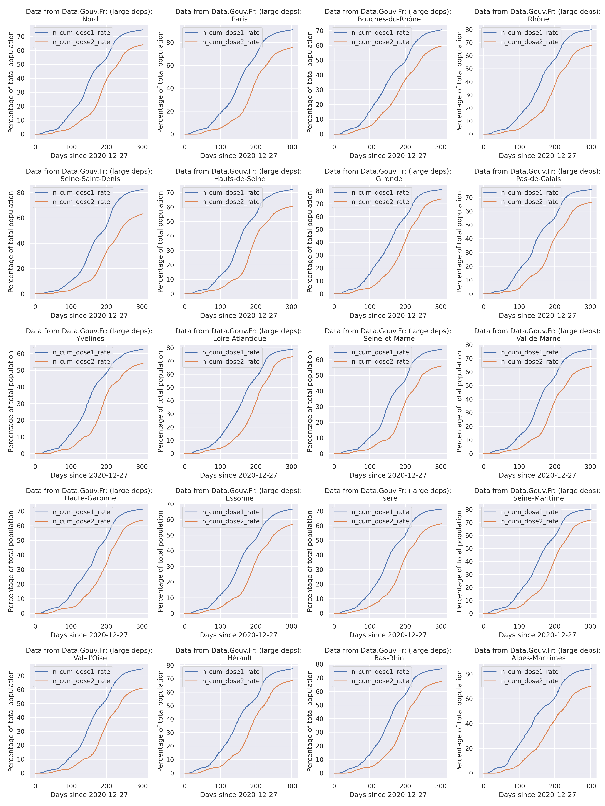
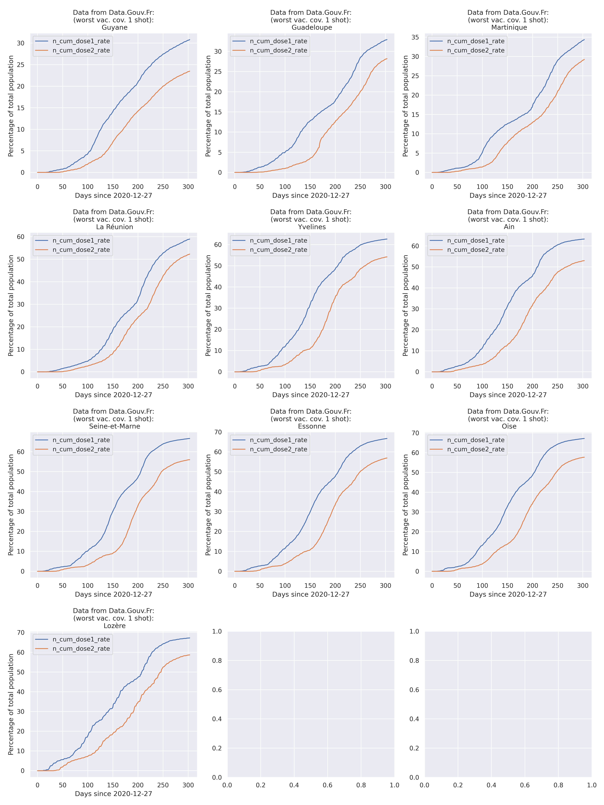
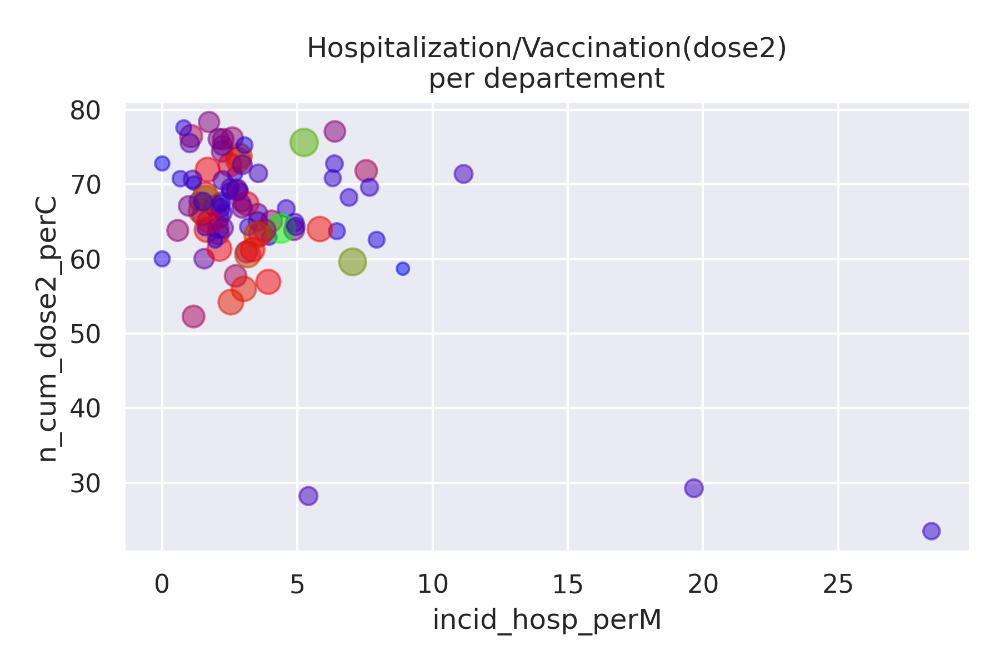
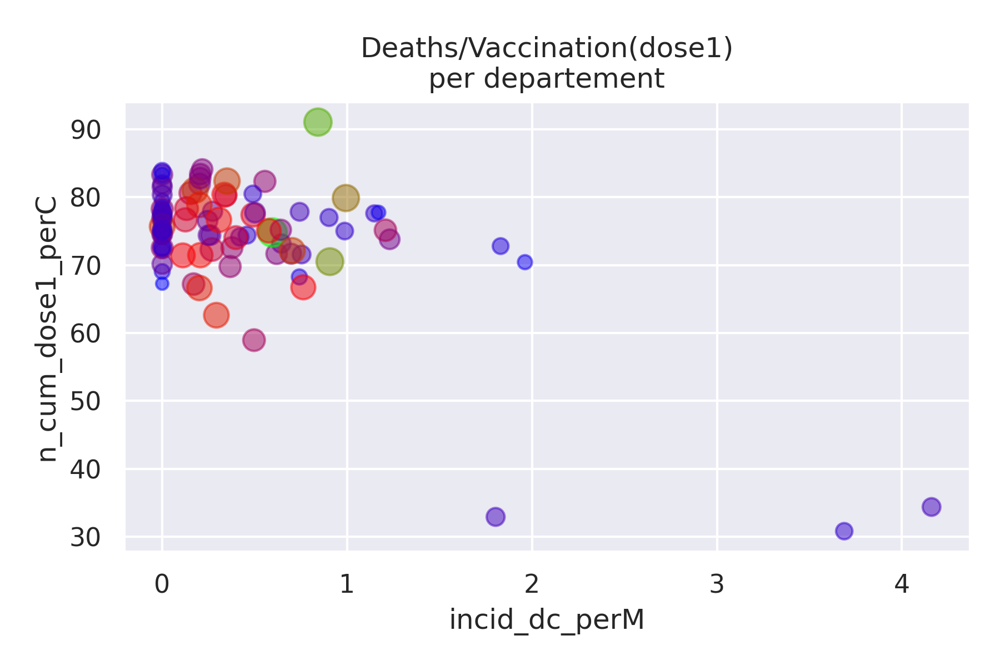

# Data concerning vaccination

This page describes results concerning vaccinations in France.

## TOC
<!--TOC-->

- [Data concerning vaccination](#data-concerning-vaccination)
  - [TOC](#toc)
  - [Vaccination timeline](#vaccination-timeline)
  - [Vaccination vs. outcomes](#vaccination-vs-outcomes)

<!--TOC-->

## Vaccination timeline

<TABLE>
  <TR><TD COLSPAN="1">
Vaccination timeline
</TD> </TR>
  <TR><TD COLSPAN="1">
From 'data.gouv.fr'
</TD> </TR>
  <TR> <TD> </TD> </TR>
  <TR><TD COLSPAN="1">
All vaccines types, cumulative
</TD> </TR>
</TABLE>    

<TABLE>
  <TR><TD COLSPAN="1">
Vaccination timeline
</TD> </TR>
  <TR> <TD> </TD> </TR>
  <TR><TD COLSPAN="1">
Comparison of vaccines types, cumulative
</TD> </TR>
</TABLE>    

<TABLE>
  <TR><TD COLSPAN="1">
Vaccination timeline by département
</TD> </TR>
  <TR> <TD> </TD> </TR>
  <TR><TD COLSPAN="1">
All vaccines types, cumulative
</TD> </TR>
  <TR><TD COLSPAN="1">
Largest départements
</TD> </TR>
</TABLE>    

<TABLE>
  <TR><TD COLSPAN="1">
Vaccination timeline by département
</TD> </TR>
  <TR> <TD> </TD> </TR>
  <TR><TD COLSPAN="1">
All vaccines types, cumulative
</TD> </TR>
  <TR><TD COLSPAN="1">
Départements with best vaccine coverage
</TD> </TR>
</TABLE>    

<TABLE>
  <TR><TD COLSPAN="1">
Vaccination timeline by département
</TD> </TR>
  <TR> <TD> </TD> </TR>
  <TR><TD COLSPAN="1">
All vaccines types, cumulative
</TD> </TR>
  <TR><TD COLSPAN="1">
Départements with lowest vaccine coverage
</TD> </TR>
</TABLE>    

<TABLE>
  <TR><TD COLSPAN="1">
Percentage of population vaccinated by département
</TD> </TR>
  <TR> <TD> </TD> </TR>
  <TR><TD COLSPAN="1">
All vaccines types, cumulative
</TD> </TR>
</TABLE>    

## Vaccination vs. outcomes

Here data is shown either in event per million people or percent, with labels
indicating `perM` or `perC` 

<TABLE>
  <TR><TD COLSPAN="1">
Vaccination / Hospitalizations
</TD> </TR>
  <TR> <TD> </TD> </TR>
  <TR><TD COLSPAN="1">
All vaccines types, cumulative
</TD> </TR>
</TABLE>    

<TABLE>
  <TR><TD COLSPAN="2">
Vaccination / Deaths
</TD> </TR>
  <TR> <TD> </TD> 
       <TD> </TD>  </TR>
  <TR><TD COLSPAN="2">
All vaccines types, cumulative
</TD> </TR>
  <TR> <TD> </TD> </TR>

</TABLE>    

<TABLE>
  <TR><TD COLSPAN="1">
ICU/ Deaths
</TD> </TR>
  <TR> <TD> </TD>  </TR>
  <TR><TD COLSPAN="1">
ICU/ Hospitalizations
</TD> </TR>
  <TR> <TD> </TD> </TR>
  <TR><TD COLSPAN="1">
Hospitalizations/ Deaths
</TD> </TR>
  <TR> <TD> </TD> </TR>
  <TR><TD COLSPAN="1">
All vaccines types, cumulative
</TD> </TR>

</TABLE>    
