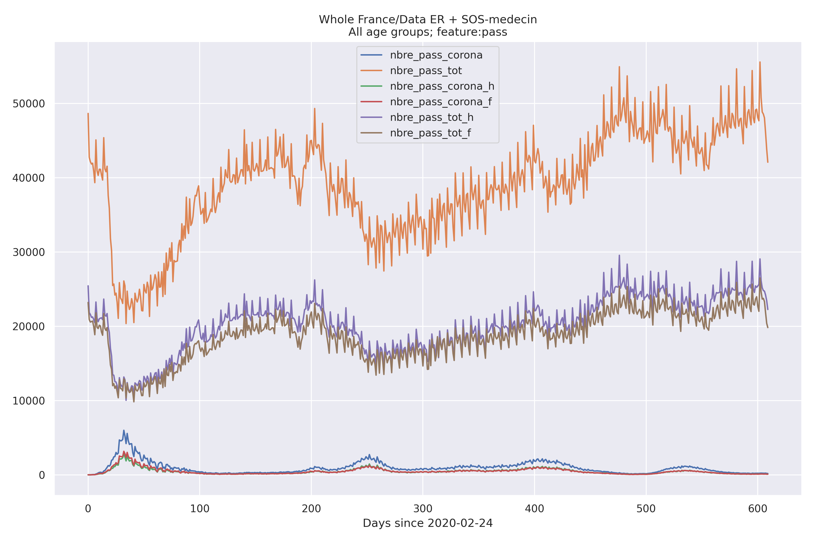
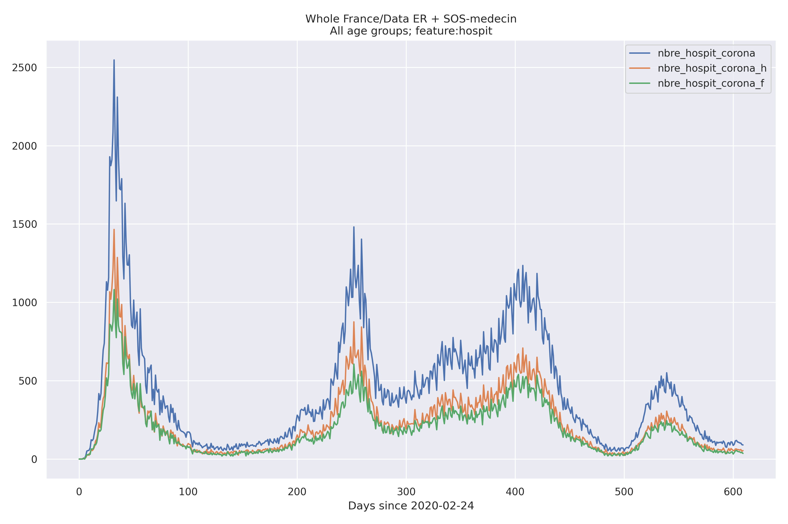
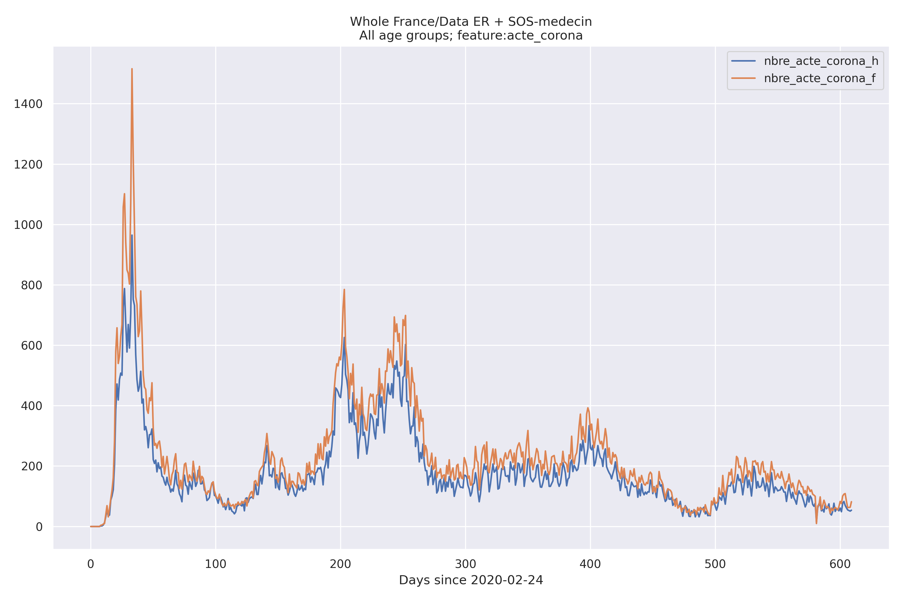
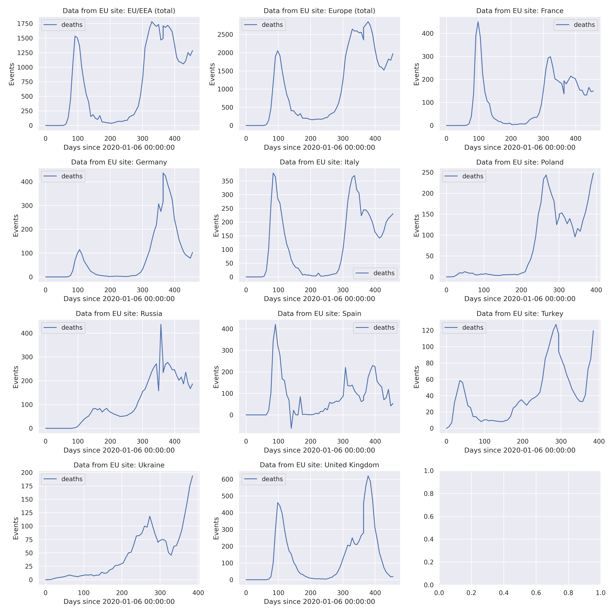
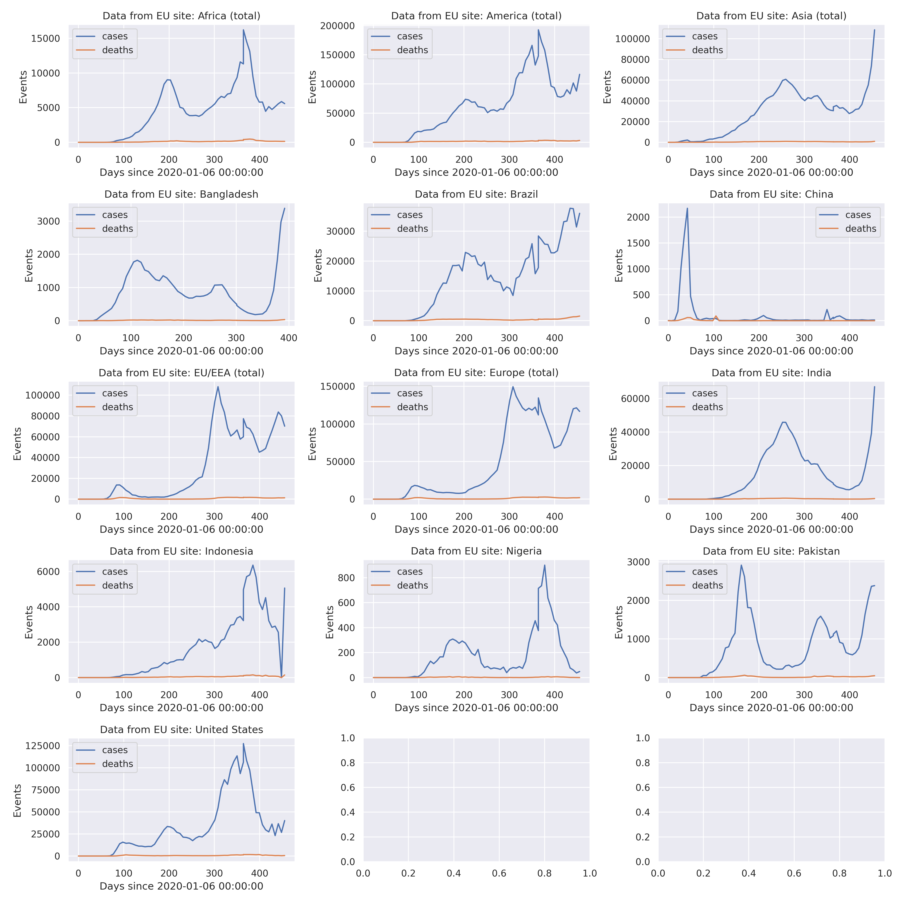
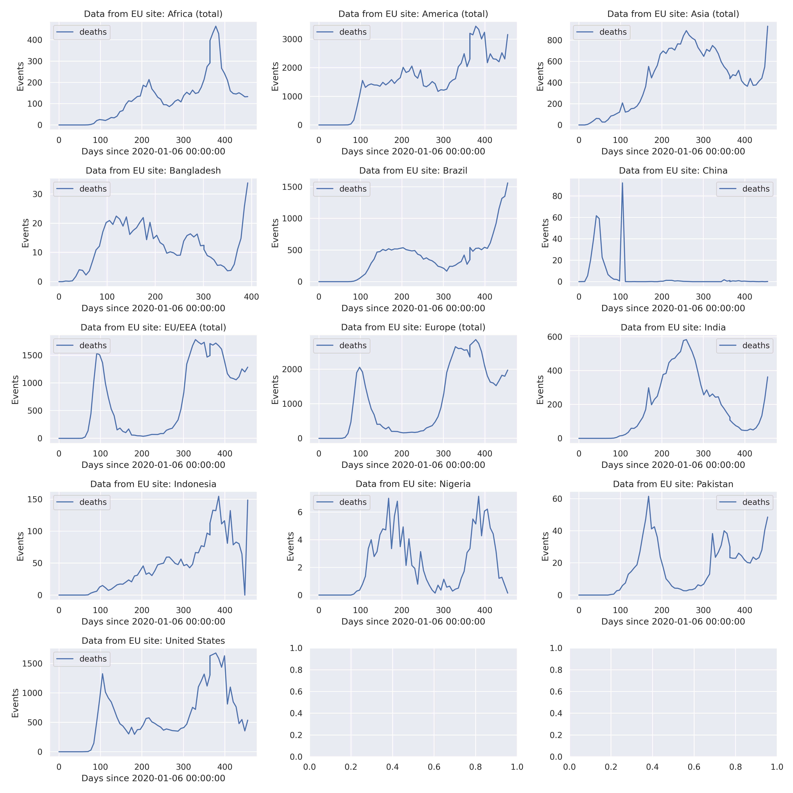
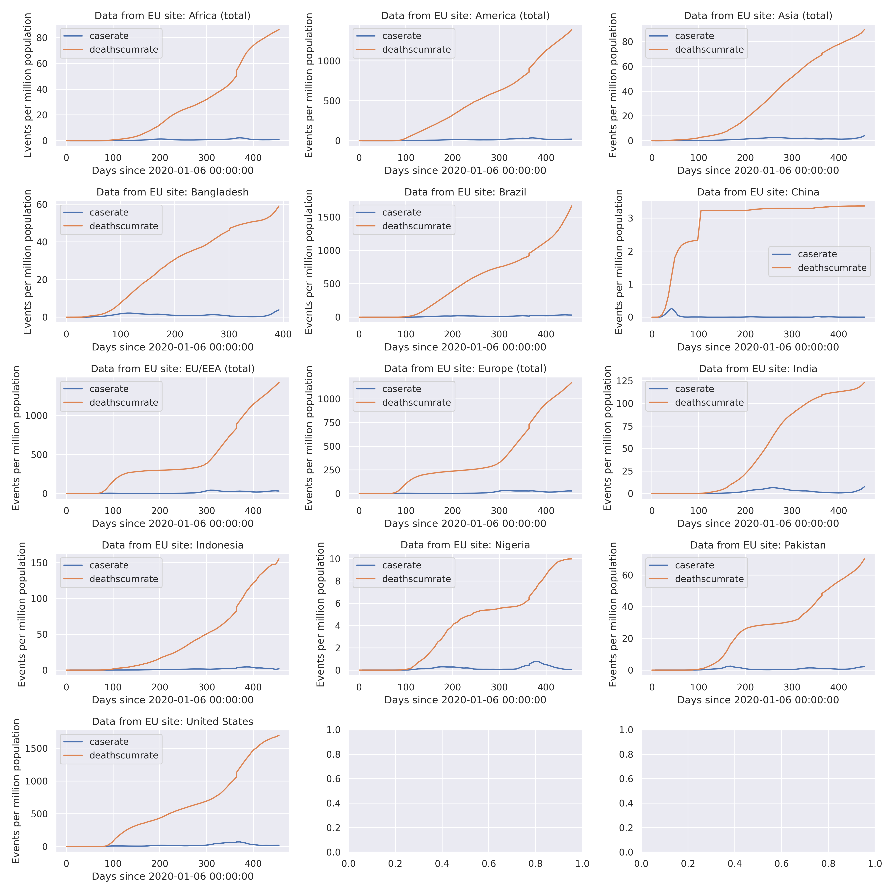
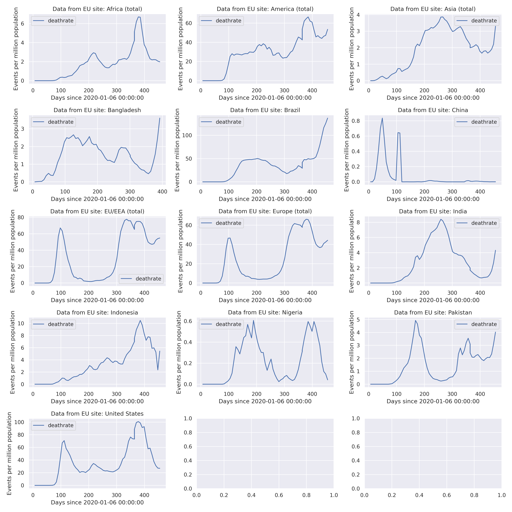
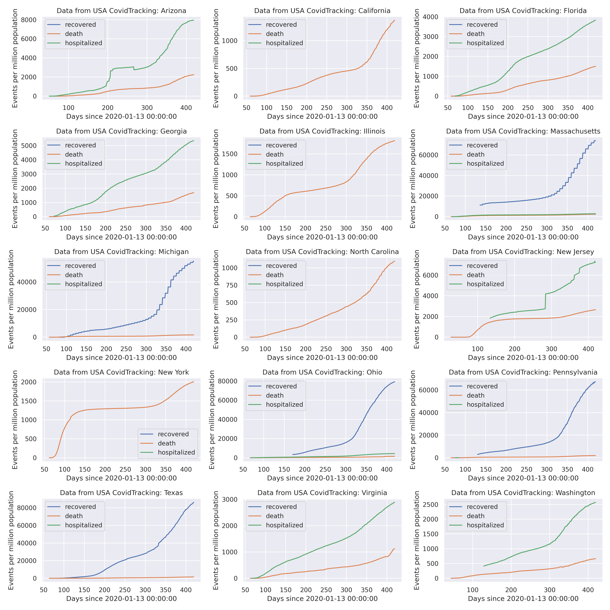
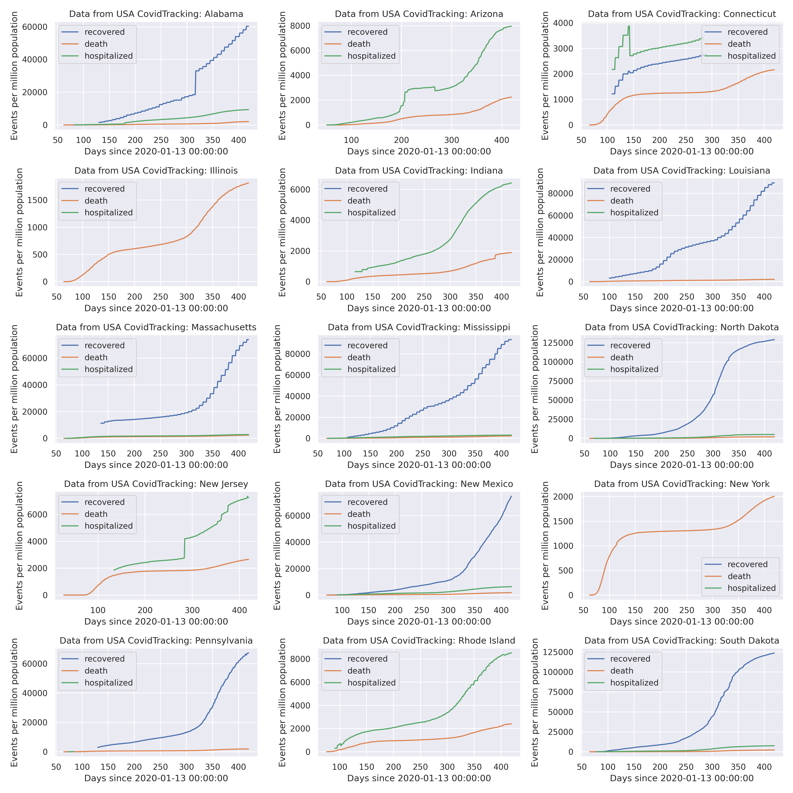

## Gallery

<TABLE>
 <TR><TD COLSPAN="3">Some legends are in french: </TD> </TR>
 <TR><TD >rad</TD> <TD >retour à domicile</TD><TD >discharged (cumulative)</TD></TR>
 <TR><TD >rea</TD> <TD >réanimation</TD><TD >ICU</TD></TR>
 <TR><TD >dc</TD> <TD >décédé</TD><TD >deceased (cumulative)</TD></TR>
 <TR><TD >hosp</TD> <TD >hospitalisé</TD><TD > hospitalized</TD></TR>
</TABLE>

<TABLE>
 <TR><TD COLSPAN="2">Hospital Data (France)</TD> </TR>
 <TF><TD>All</TD> <TD>
Split male/female
</TD> </TR>
 <TR><TD> </TD> 
     <TD> </TD> 
 </TR>
 </TABLE>
<TABLE>
    <TR><TD COLSPAN="2">
Hospital Data (France)
</TD> </TR>
    <TR><TD COLSPAN="2">
All , Split according age groups
</TD> </TR>
    <TR><TD COLSPAN="2"> </TD></TR> 
    <TR>  <TD COLSPAN="1">
Testing
</TD>  <TD COLSPAN="1">Change in patient status according to population</TD> </TR>
    <TR> <TD> </TD>
         <TD> </TD></TR>
 </TABLE>

<TABLE>
 <TR><TD COLSPAN="1">Visits / Activity(France ER + SOS Medecin) </TD> </TR>
 <TR><TD>
Visits
</TD> </TR>
 <TR><TD> </TD></TR>
 <TR><TD>
Hospitalization
</TD> </TR>
 <TR><TD> </TD></TR>
 <TR><TD>
Corona actions
</TD> </TR>
 <TR><TD> </TD></TR>
 </TABLE>

<TABLE>
  <TR><TD COLSPAN="1">
Comparison between largest 'départements'
</TD> </TR>
  <TR> <TD> </TD> </TR>
    <TR> <TD>
 The same in **log scale** 
</TD> </TR>
   <TR> <TD> </TD> </TR>
</TABLE>    

<TABLE>
  <TR><TD COLSPAN="1">
Comparison between some European countries
</TD> </TR>
  <TR> <TD> </TD> </TR>
  <TR> <TD> </TD> </TR>
  <TR> <TD> </TD> </TR>
  <TR> <TD> </TD> </TR>
  <TR> <TD> </TD> </TR>
</TABLE>    

<TABLE>
  <TR><TD COLSPAN="1">
Comparison between most populated countries
</TD> </TR>
  <TR> <TD> </TD> </TR>
  <TR> <TD> </TD> </TR>
  <TR> <TD> </TD> </TR>
  <TR> <TD> </TD> </TR>
  <TR> <TD> </TD> </TR>
</TABLE>    

<TABLE>
  <TR><TD COLSPAN="1">
Comparison between US States
</TD> </TR>
    <TR> <TD>
 Most populated states
</TD> </TR>
  <TR> <TD> </TD> </TR>
    <TR> <TD>
 With largest mortality per inhabitant
</TD> </TR>
  <TR> <TD> </TD> </TR>
</TABLE>    
For US data, Covid data from: <A HREF="https://covidtracking.com">https://covidtracking.com</A>,
population data from <A HREF="http://www2.census.gov/programs-surveys/popest/datasets/2010-2019/national">
http://www2.census.gov/programs-surveys/popest/datasets/2010-2019/national</A>.

