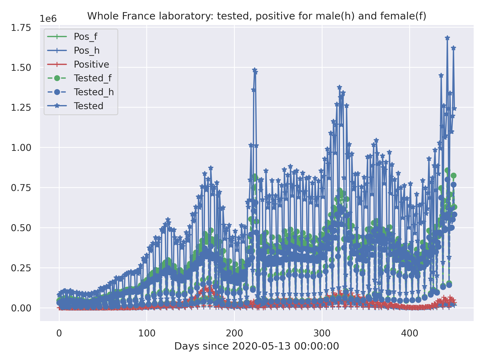
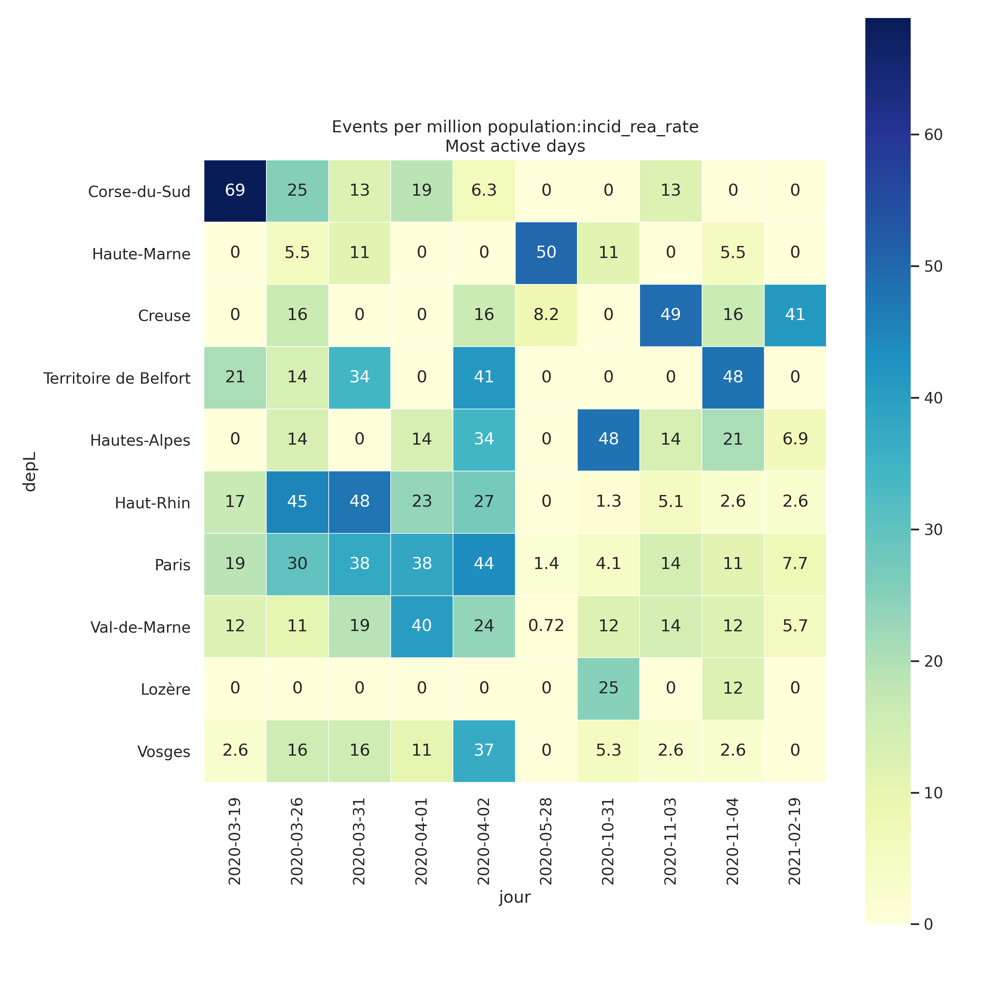
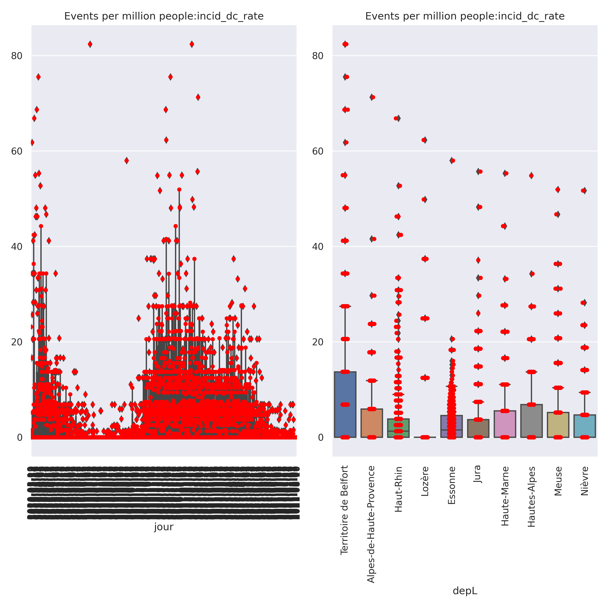

# Simple Python analysis tools for COVID-19 / SARS-cov-19 data 
 These scripts are intended to work with COVID-19 / SARS-cov-19
 data provided by Santé publique France and INSEE.

The scripts provides for automated update of the data sources used, which are located:
- https://www.data.gouv.fr/fr/datasets/donnees-hospitalieres-relatives-a-lepidemie-de-covid-19/
- https://www.data.gouv.fr/en/datasets/donnees-des-urgences-hospitalieres-et-de-sos-medecins-relatives-a-lepidemie-de-covid-19/


Mostly this consists of jupyter notebook(s), while python scripts are also provided
almost direct transpositions of the notebooks. This is supported by library modules.


## Aim:
There are many good and interesting contributions on the pages 
- https://www.data.gouv.fr/fr/datasets/donnees-hospitalieres-relatives-a-lepidemie-de-covid-19
and
- https://www.data.gouv.fr/en/datasets/donnees-des-urgences-hospitalieres-et-de-sos-medecins-relatives-a-lepidemie-de-covid-19/,

however this is a very straightforward piece of code, intended mostly to facilitate
access to the data for testing personal "what-if" hypotheses.

## Gallery
Some legends are in french: 
- **rad** : "retour à domicile" : discharged (cumulative)
- **rea**  : ICU
- **dc**   : deceased (cumulative)
- **hosp** : hospitalized

<TABLE>
 <TR><TD COLSPAN="2">Hospital Data</TD> </TR>
 <TF><TD>All</TD> <TD><CENTER>Split male/female</TD> </TR>
 <TR><TD> </TD> 
     <TD> </TD> 
 </TR>
 </TABLE>
<TABLE>
    <TR><TD COLSPAN="2"><CENTER>Hospital Data</CENTER></TD> </TR>
    <TR><TD COLSPAN="2"><CENTER>All , Split according age groups</CENTER></TD> </TR>
    <TR><TD COLSPAN="2"> </TD></TR> 
    <TR>  <TD COLSPAN="1"><CENTER>Testing</CENTER></TD>  <TD COLSPAN="1">Change in patient status according to population</TD> </TR>
    <TR> <TD> </TD>
         <TD> </TD></TR>
 </TABLE>
<TABLE>
  <TR><TD COLSPAN="1"><CENTER>Activity according to date and area</CENTER></TD> </TR>
  <TR> <TD> </TD> </TR>
   <TR> <TD> </TD> </TR>
</TABLE>    

## Functionality
- Jupyter notebook(s): display data. Automatically make use of the latest version of the  data provided, it is cached locally 
   with  update synchronization with remote site (automatic, after prescribed time interval)
- `DataGrouvFr` Python module :
   - manage a local repository with files from www.data.gouv.fr by handling file version/timestamp in file name. 
   - automate the transfer of files with badge "covid-19", maintain a local cache of
     information concerning these files. This is performed using the API (`http` based) documented
      on https://doc.data.gouv.fr/api/reference/#/datasets/list_datasets 
   - permit some inquiries on the downmoaded/cached meta data describing the data loaded from the remote site
- `figureHelpers.py` module:
   - some convenience tools to facilitate/automate making `matplotlib` figures. (Also looking forwards towards ̀seaborn`... after some wait... )

   For more information on changes (and bugs), see the git log.

## install requirement
### Python
- This requires Python 3, and has been tested with Python 3.6.5, on a Linux
Ubuntu 18.04 LTS system.

- In the current version, the library is dependent on
some features from the IPython package, which comes with Jupyter. This constraint
may be removed in the future.

### Libraries
```
pip install -U -R requirements.txt

```


## install requirement
### Python
- This requires Python 3, and has been tested with Python 3.6.5, on a Linux
Ubuntu 18.04 LTS system.

- In the current version, the library is dependent on
some features from the IPython package, which comes with Jupyter. This constraint
may be removed in the future.

### Libraries
```
pip install -U -R requirements.txt

```


## Warning(s)
This is provided as is, see the LICENSE file. Development is ongoing

## References
- https://github.com/alichnewsky/covid : basic script to work with the Novel Coronavirus (COVID-19) cases 
      dataset provided by JHU CSSE
- in France
  - https://www.academie-sciences.fr/fr/: many references

  - https://www.eficiens.com/coronavirus-statistiques/#evolution-contamination-france: well represented statistics

- other Covid related sites/developments:
  - https://github.com/dariocazzani/COVID-19-trends
  
