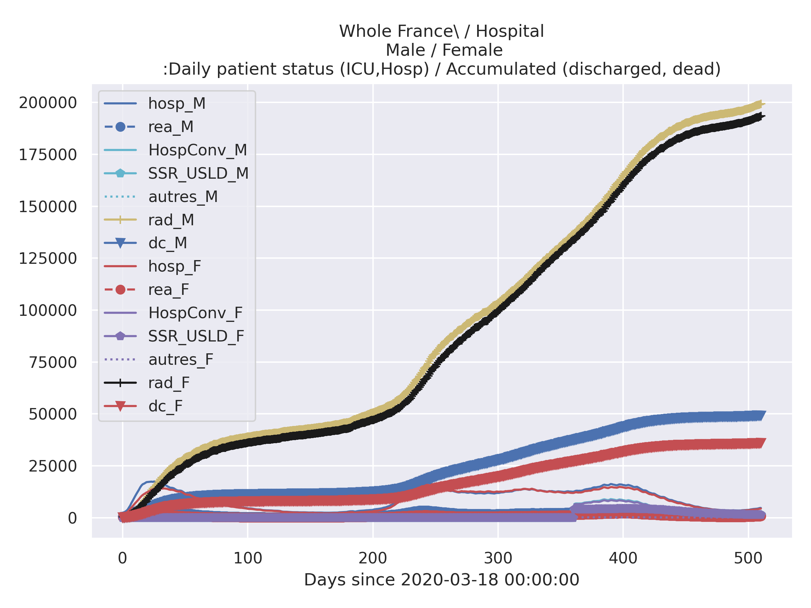
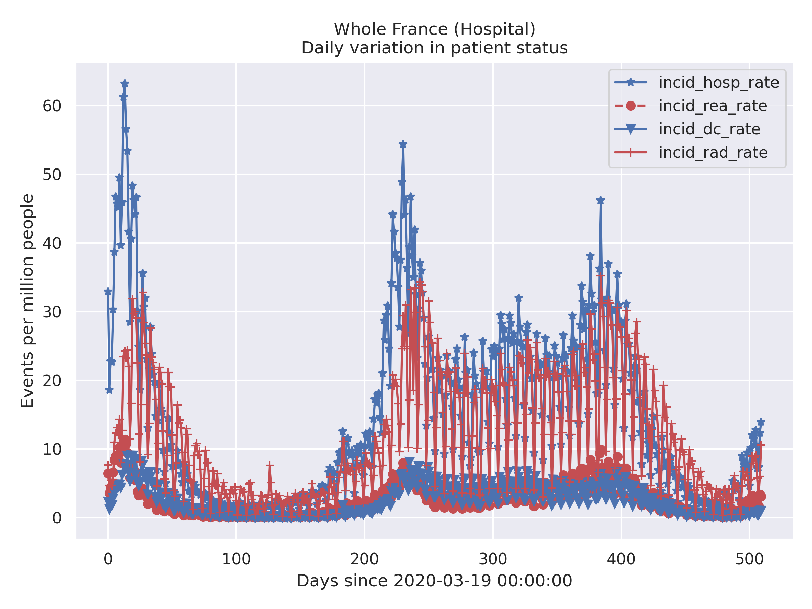
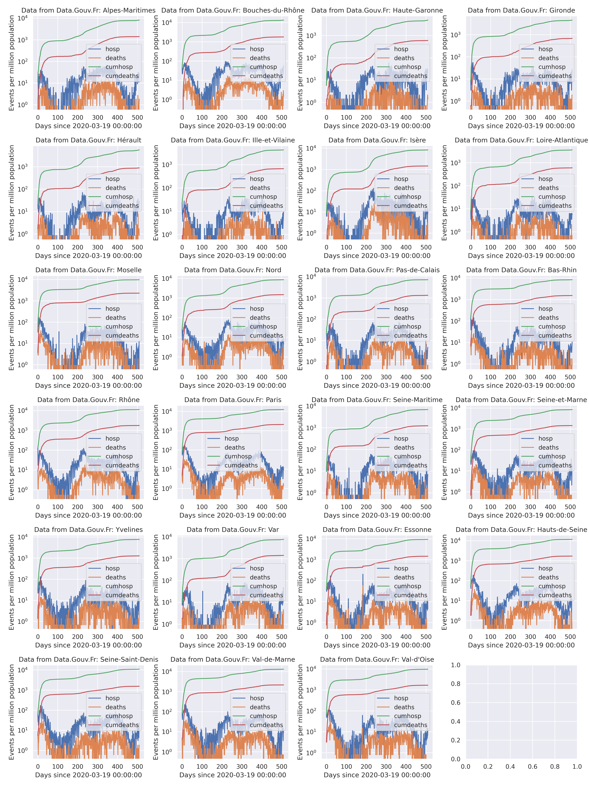

# Simple Python analysis tools for COVID-19 / SARS-cov-19 data


 These scripts are intended to facilitate synchronizing with several data
 sources, including:
  - data appearing on www.data.gouv.fr (French government Open Data)
  - data appearing on EU Open Data Portal (EU ODP)  <A HREF="https://data.europa.eu/">https://data.europa.eu/</A>
 Are also included some exploitation tools using python's ̀panda`, `matplotlib` and `seaborn` packages
 
 Jupyter notebooks included work with COVID-19 / SARS-cov-19
 data provided by Santé publique France and INSEE,  which include:
- https://www.data.gouv.fr/fr/datasets/donnees-hospitalieres-relatives-a-lepidemie-de-covid-19/
- https://www.data.gouv.fr/en/datasets/donnees-des-urgences-hospitalieres-et-de-sos-medecins-relatives-a-lepidemie-de-covid-19/


Mostly this consists of
- jupyter notebook(s),
- python scripts, almost direct transpositions of the notebooks. 
- a small library 


## Aim:
- facilitate to locally manage and update a cache of data
- facilitate access to that data for analysis and display

## Gallery

<TABLE>
 <TR><TD COLSPAN="3">Some legends are in french: </TD> </TR>
 <TR><TD >rad</TD> <TD >retour à domicile</TD><TD >discharged (cumulative)</TD></TR>
 <TR><TD >rea</TD> <TD >réanimation</TD><TD >ICU</TD></TR>
 <TR><TD >dc</TD> <TD >décédé</TD><TD >deceased (cumulative)</TD></TR>
 <TR><TD >hosp</TD> <TD >hospitalisé</TD><TD > hospitalized</TD></TR>
</TABLE>

<TABLE>
 <TR><TD COLSPAN="2">Hospital Data</TD> </TR>
 <TF><TD>All</TD> <TD><CENTER>Split male/female</CENTER></TD> </TR>
 <TR><TD> </TD> 
     <TD> </TD> 
 </TR>
 </TABLE>
<TABLE>
    <TR><TD COLSPAN="2"><CENTER>Hospital Data</CENTER></TD> </TR>
    <TR><TD COLSPAN="2"><CENTER>All , Split according age groups</CENTER></TD> </TR>
    <TR><TD COLSPAN="2"> </TD></TR> 
    <TR>  <TD COLSPAN="1"><CENTER>Testing</CENTER></TD>  <TD COLSPAN="1">Change in patient status according to population</TD> </TR>
    <TR> <TD> </TD>
         <TD> </TD></TR>
 </TABLE>
<TABLE>
  <TR><TD COLSPAN="1"><CENTER>Comparison between largest 'départements'</CENTER></TD> </TR>
  <TR> <TD> </TD> </TR>
    <TR> <TD><CENTER> The same in **log scale** </CENTER></TD> </TR>
   <TR> <TD> </TD> </TR>
</TABLE>    

<TABLE>
  <TR><TD COLSPAN="1"><CENTER>Comparison between some European countries</CENTER></TD> </TR>
  <TR> <TD> </TD> </TR>
    <TR> <TD><CENTER> The same in **log scale** </CENTER></TD> </TR>
   <TR> <TD> </TD> </TR>
</TABLE>    


## Functionality
- Jupyter notebook(s): display data. Automatically make use of the latest version of the  data provided,
   which is cached locally   with  update synchronization with the remote site (automatic, after prescribed time interval)
- Python modules :
   - manage a local repository with files by handling file version/timestamp in file name. 
   - automate the transfer of files with located on the remote site:
     - identified by badge "covid-19" on  <A HREF="doc.data.gouv.fr">doc.data.gouv.fr</A>.
      This uses the API (`http` based) documented  on <A HREF="https://doc.data.gouv.fr/api/reference/#/datasets/list_datasets">
      https://doc.data.gouv.fr/api/reference/#/datasets/list_datasets </A>
     - identified by a SPARQL filtering regular expression on  <A HREF="https://data.europa.eu/"https://data.europa.eu/</A>
       SPARQL entry point, using the 
   - permit some inquiries on the downmoaded/cached meta data describing the data loaded from the remote site
   - `figureHelpers.py` module:
     - some convenience tools to facilitate/automate making `matplotlib` figures. (Also looking forwards towards ̀seaborn`... after some wait... )

   For more information on changes (and bugs), see the git log.

## install requirement
### Python
- This requires Python 3, and has been tested with Python 3.6.5, on a Linux
Ubuntu 18.04 LTS system.

- In the current version, the library is dependent on
some features from the IPython package, which comes with Jupyter. This constraint
may be removed in the future.

### Libraries
```
pip install -U -R requirements.txt

```


## Warning(s)
This is provided as is, see the LICENSE file. Development is ongoing.

## References
- https://github.com/alichnewsky/covid : basic script to work with the Novel Coronavirus (COVID-19) cases 
      dataset provided by JHU CSSE
- in France
  - https://www.academie-sciences.fr/fr/: many references

  - https://www.eficiens.com/coronavirus-statistiques/#evolution-contamination-france: well represented statistics

- other Covid related sites/developments:
  - https://github.com/dariocazzani/COVID-19-trends
  
