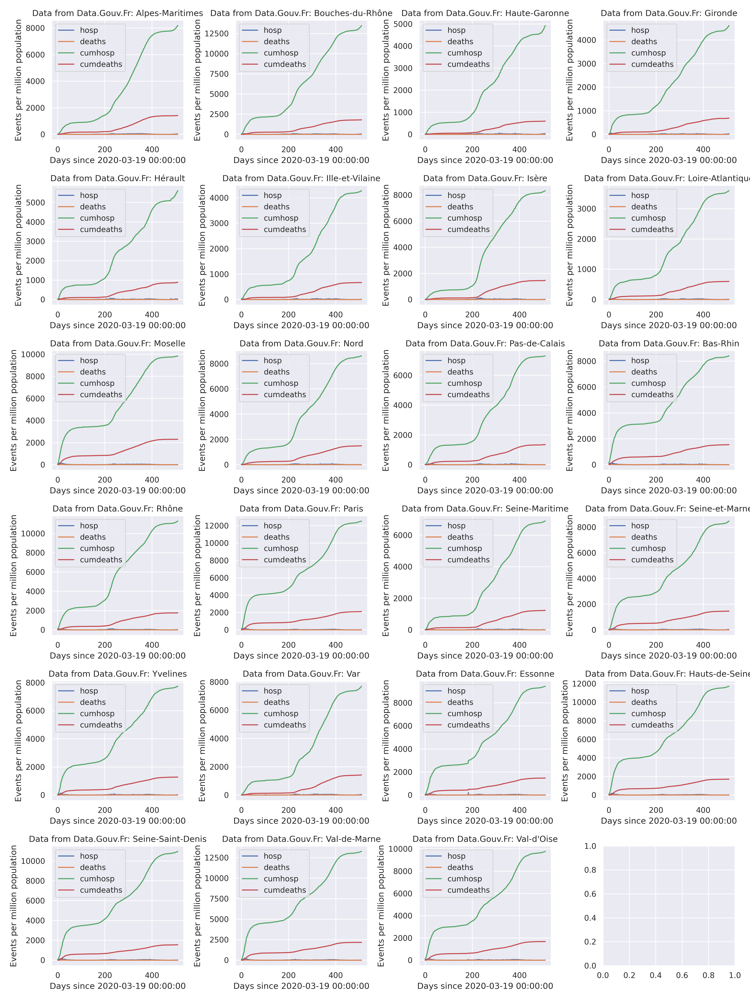
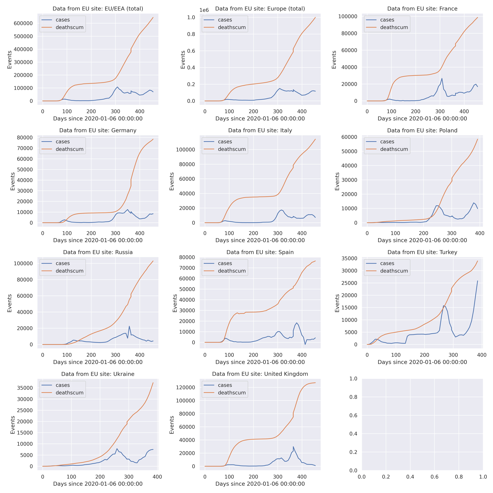

# Simple Python analysis tools for COVID-19 / SARS-cov-19 data


 These scripts are intended to facilitate synchronizing with several data
 sources, including:
  - data appearing on www.data.gouv.fr (French government Open Data)
  - data appearing on EU Open Data Portal (EU ODP)  <A HREF="https://data.europa.eu/">https://data.europa.eu/</A>
 Are also included some exploitation tools using python's ̀panda`, `matplotlib` and `seaborn` packages. 
 
 Some comments about data found by our automated process and not exploited (yet ?) are
 in [README-Data.md](./README-Data.md).
 
 Jupyter notebooks included work with COVID-19 / SARS-cov-19
 data provided by Santé publique France and INSEE,  which include:
- https://www.data.gouv.fr/fr/datasets/donnees-hospitalieres-relatives-a-lepidemie-de-covid-19/
- https://www.data.gouv.fr/en/datasets/donnees-des-urgences-hospitalieres-et-de-sos-medecins-relatives-a-lepidemie-de-covid-19/


Mostly this consists of
- jupyter notebook(s),
- python scripts, almost direct transpositions of the notebooks. 
- a small library 


## Aim:
- facilitate to locally manage and update a cache of data
- facilitate access to that data for analysis and display

## Gallery

See [README-gallery.md](./README-gallery.md) for more.

<TABLE>
  <TR><TD COLSPAN="1"><CENTER>Comparison between largest 'départements'</CENTER></TD> </TR>
  <TR><TD COLSPAN="1"><CENTER>From 'data.gouv.fr'</CENTER></TD> </TR>
  <TR> <TD> </TD> </TR>
</TABLE>    

<TABLE>
  <TR><TD COLSPAN="1"><CENTER>Comparison between some European countries</CENTER></TD> </TR>
  <TR><TD COLSPAN="1"><CENTER>From 'data.europa.eu'</CENTER></TD> </TR>
  <TR> <TD> </TD> </TR>
</TABLE>    


## Functionality
- Jupyter notebook(s): display data. Automatically make use of the latest version of the  data provided,
   which is cached locally   with  update synchronization with the remote site (automatic, after prescribed time interval)
- Python modules :
   - manage a local repository with files by handling file version/timestamp in file name. 
   - automate the transfer of files with located on the remote site:
     - identified by badge "covid-19" on  <A HREF="doc.data.gouv.fr">doc.data.gouv.fr</A>.
      This uses the API (`http` based) documented at <A HREF="https://doc.data.gouv.fr/api/reference/#/datasets/list_datasets">
      https://doc.data.gouv.fr/api/reference/#/datasets/list_datasets </A>
     - identified by a SPARQL filtering regular expression on  <A HREF="https://data.europa.eu/">https://data.europa.eu/</A>
       SPARQL entry point, using the 
   - permit some inquiries on the downmoaded/cached meta data describing the data loaded from the remote site
   - `figureHelpers.py` module:
     - some convenience tools to facilitate/automate making `matplotlib` figures. (Also looking forwards towards ̀seaborn`... after some wait... )

   - perform some data analyses (model parameter fitting), see: <A HREF="./JupySessions/FIT-Data-FromGouv.ipynb">./JupySessions/FIT-Data-FromGouv.ipynb</A>
   
### Bugs and changes
  - For more information on changes (and bugs), see the git log.
  - Concerning the European site ̀data.europa.eu`:
    1. an issue has been corrected, see 
        [README-Bug-X-EuRDF.md](./README-Bug-X-EuRDF.md)
    2. Change in format of the data files collected (introducing weekly data) is
	   in process. More in [README-Data.md](./README-Data.md).
  
  - **TBD**: reduce redundancy (same files with different extensions) in cached data, 
  for now caches take more space than really needed
  
## install requirement
### Python
- This requires Python 3, and has been tested with Python 3.8.2, on a Linux
Ubuntu 20.04 LTS system. (Note: an earlier version worked with Python 3.6.5 on
Ubuntu 18.04 LTS.)

- In the current version, the library is dependent on
some features from the IPython package, which comes with Jupyter. This constraint
may be removed in the future.

### Jupyter
  This is used with Jupyter as natively integrated / installed in the Ubuntu 20.04 LTS
  distribution.
  
### Libraries
```
pip install -U -R requirements.txt

```


## Warning(s)
This is provided as is, see the LICENSE file. Development is ongoing.

## References
- https://github.com/alichnewsky/covid : basic script to work with the Novel Coronavirus (COVID-19) cases 
      dataset provided by JHU CSSE
- in France
  - https://www.academie-sciences.fr/fr/: many references

  - https://www.eficiens.com/coronavirus-statistiques/#evolution-contamination-france: well represented statistics

- other Covid related sites/developments:
  - https://github.com/dariocazzani/COVID-19-trends
  
