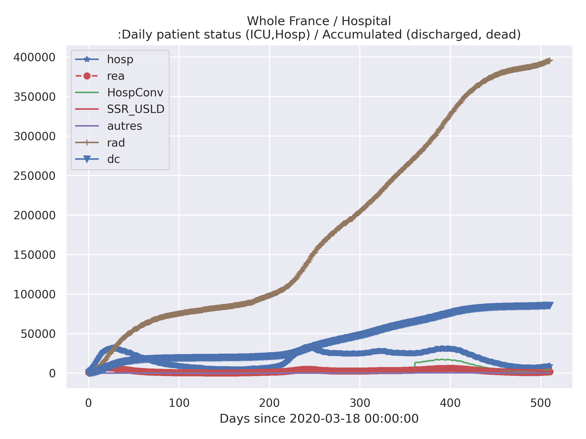

# Simple python scripts to work with COVID-19 / SARS-cov-19 data provided by Santé publique France

https://www.data.gouv.fr/fr/datasets/donnees-hospitalieres-relatives-a-lepidemie-de-covid-19/
https://www.data.gouv.fr/en/datasets/donnees-des-urgences-hospitalieres-et-de-sos-medecins-relatives-a-lepidemie-de-covid-19/

basic script to work with the [Novel Coronavirus (COVID-19) cases dataset provided by JHU CSSE](https://systems.jhu.edu/research/public-health/ncov/)

Mostly this consists of jupyter notebook(s), while python scripts are also provided
almost direct transpositions of the notebooks.


## Aim:
There are many good and interesting contributions on the pages 
https://www.data.gouv.fr/fr/datasets/donnees-hospitalieres-relatives-a-lepidemie-de-covid-19
and
https://www.data.gouv.fr/en/datasets/donnees-des-urgences-hospitalieres-et-de-sos-medecins-relatives-a-lepidemie-de-covid-19/,
however this is a very straightforward piece of code, intended mostly to facilitate
access to the data for testing personal "what-if" hypotheses.

## Gallery




## install requirements
### Python
This requires Python 3, and has been tested with Python 3.6.5, on a Linux
Ubuntu 18.04 LTS system.

### Libraries
```
pip install -U -R requirements.txt

```

## Warning(s)
This is provided as is, see the LICENSE file.

## References
- https://github.com/alichnewsky/covid
